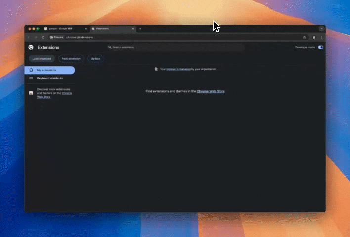
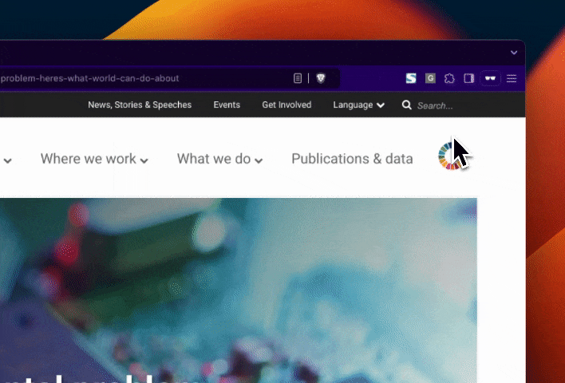

# GeminiAI 翻訳アドオン

## 概要

GeminiAI 翻訳アドオンは、Google が提供する Gemini AI を利用して、選択したテキストを英語から日本語に翻訳できる Chrome 拡張機能です。ウェブページ上の任意のテキストを簡単に翻訳し、その翻訳結果に対する解説機能も提供します。

**注意**: 本拡張機能は公式の Google 製品ではありません。また、Google および Gemini AI の商標や知的財産権は、それぞれの正当な権利者に帰属します。

## 主な機能

- 選択テキストの翻訳（キーボードショートカット：5 キー）
- コンテキストメニューからの翻訳実行
- 翻訳結果の解説機能
- API キーの保存と管理
- 暗号資産による開発支援

## インストール方法

1. 本リポジトリをクローンまたは ZIP ファイルとしてダウンロードします。
2. Chrome ブラウザで `chrome://extensions/` にアクセスします。
3. 「デベロッパーモード」を有効にします。
4. 「パッケージ化されていない拡張機能を読み込む」をクリックします。
5. ダウンロードしたプロジェクトフォルダを選択します。

## 使用方法

1. [公式サイト](https://ai.google.dev/gemini-api/docs?hl=ja)にアクセスし、API キーを取得してください。
2. API キーの発行や利用については、Google の規約・ポリシーをご確認ください。
3. 翻訳したいテキストをウェブページ上で選択します。
4. 以下のいずれかの方法で翻訳を実行します：
   - キーボードの「5」キーを押す
   - 選択テキストを右クリックし、「選択テキストを翻訳」を選択
5. 翻訳結果がツールチップとして表示されます。
6. 翻訳結果の特定部分を選択すると、その部分の解説が表示されます。

## 設定

1. 拡張機能のアイコンをクリックしてポップアップを表示します。
2. Gemini API キーを入力し「保存」をクリックします。

3. API キーの表示/非表示は「👁️」アイコンで切り替え可能です。

## 寄付

このプロジェクトの開発を支援いただける場合、以下の暗号資産アドレスに寄付が可能です。寄付は任意であり、強制ではありません。

- **Ethereum (EVM)**: 0x1a875E9b4a8fdeA307F8cDb5A7dAe4BEBF03968E
- **Solana (SOL)**: ET99PFkX8BbokRCSz8s9vdwPE7ZnRC9sFp9LAiftPp43
- **Bitcoin (BTC)**: bc1qpgmh4y0k09wuwad82uu965jzjlc2qsxfzyu3h4

## 免責事項・注意事項

### 非公式サービスであること

本拡張機能は Google および Gemini AI の公式製品やサービスではありません。また、Google および Gemini AI の利用規約・使用条件に抵触しないようにご利用者自身が確認のうえご使用ください。

### 第三者の権利について

翻訳するテキストや利用するサービスに関しては、著作権やその他の知的財産権を侵害しないようご注意ください。違反が疑われる場合は、利用を中止し、しかるべき専門家に相談してください。

### 翻訳結果の正確性および使用について

本拡張機能を利用して得られる翻訳結果の正確性を保証するものではありません。翻訳結果の誤訳や解釈により生じた損害等について、開発者は一切の責任を負いかねます。

### API 利用に関するリスク

- Gemini AI API の使用は、Google が定める利用規約・ポリシーが適用されます。
- 利用には費用が発生する場合があり、また利用回数やリクエスト数に制限がある場合があります。
- API キーの管理はご利用者自身の責任で行ってください。漏洩や不正使用による損害について、開発者は一切責任を負いません。

### セキュリティおよびプライバシー

- 本拡張機能は機能提供に必要な範囲でテキストや API キーを扱いますが、データの保管・送信先やセキュリティについては、ご利用者自身で適切にご確認ください。
- ブラウザやネットワーク環境によっては、情報漏洩リスクが存在する可能性があります。

### 責任の制限

本拡張機能の利用により生じたいかなる損害に対しても、開発者は一切の責任を負いません。ご利用は自己責任においてお願いいたします。

### 変更・提供停止の可能性

本拡張機能は予告なく変更・提供停止する場合があります。機能変更や終了により生じる損害について、開発者は責任を負いません。

ご利用の際は、上記内容を十分ご理解・ご確認ください。

## ライセンス

本プロジェクトは MIT License の下で公開されています。詳細は LICENSE ファイルをご確認ください。
